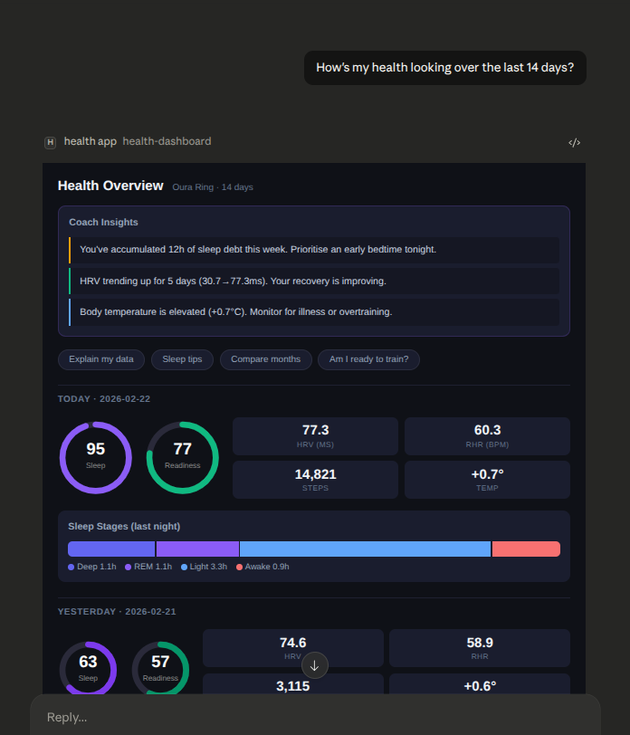
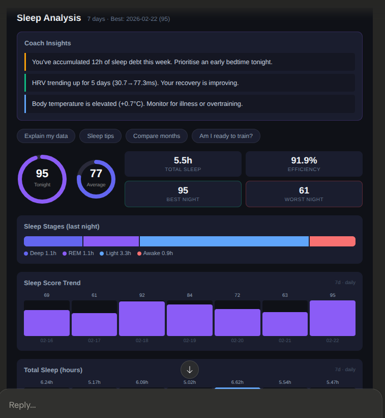
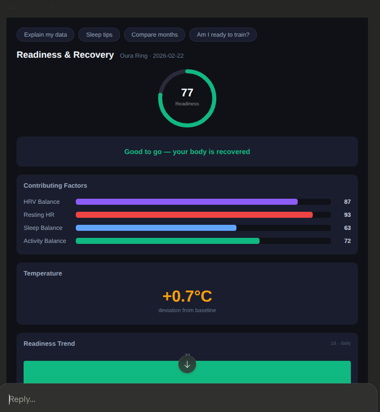

# BioVibing - Health Dashboard MCP App

A rich visual health dashboard that renders inside Claude.ai's chat interface. Built with [Skybridge](https://docs.skybridge.tech) for the Claude Code London 03 hackathon (Feb 2026).

**Theme**: Solve an everyday at-work issue — knowledge workers spend their day in AI chat. Instead of context-switching to a health app, BioVibing brings your biometrics into the conversation. Ask Claude how you slept, whether you should train, or how your recovery is trending — and get visual dashboards inline, right where you're already working.

## Screenshots

### Health Overview (14 days)
> "How's my health looking over the last 14 days?"



### Sleep Analysis
> "How have I been sleeping this week?"



### Readiness Check
> "Am I ready to train today?"



## Try it

```
How's my health looking over the last 14 days?
How did I sleep this week?
Am I ready to train today?
Show my activity for the last 30 days
Compare this week to last week
Show my health dashboard for the last 6 months
How's my sleep been over the past year?
```

## What it does

BioVibing turns Oura Ring biometric data into interactive visual dashboards directly inside Claude.ai. Claude automatically picks the right view based on your question — no menus, no navigation, just ask.

### 5 Dynamic Views

| Tool | Trigger | What it shows |
|------|---------|---------------|
| **Health Dashboard** | "How's my health?" | Full overview: sleep, readiness, HRV, steps, temperature |
| **Sleep Analysis** | "How did I sleep?" | Sleep score, stages, efficiency, HRV, sleep debt |
| **Readiness Check** | "Am I ready to train?" | Readiness score, contributing factors, temperature deviation |
| **Activity Tracker** | "Show my activity" | Steps, calories, stress vs recovery |
| **Weekly Report** | "Compare this week" | Week-over-week comparison with wins and concerns |

### Features

- **Configurable time range**: 1 to 365 days via natural language ("show last 6 months")
- **Auto-aggregating charts**: Daily (≤14d), weekly averages (15-90d), monthly averages (91-365d)
- **Coach Insights**: Observations about sleep debt, HRV trends, temperature, recovery
- **Interactive buttons**: One-click follow-up questions sent back to Claude
- **Period sections**: Today, Yesterday, and Period Average at a glance
- **Dark theme**: Designed to look native inside Claude.ai

### Data

Uses deterministic mock Oura Ring data (seeded by date). No external API calls, no tokens, no authentication required. Same date always produces the same values, so dashboards are consistent across sessions.

## Setup

```bash
pnpm install
pnpm dev
```

Opens Skybridge DevTools at `http://localhost:3000/` for local testing.

### Connect to Claude.ai

1. Start a tunnel (e.g. `cloudflared tunnel --url http://localhost:3000`)
2. In Claude.ai Settings → Connectors → Add custom connector with the tunnel URL
3. Ask Claude about your health

## Project Structure

```
├── server/src/index.ts       # MCP server: 5 tools, mock data generator, insights engine
├── web/src/
│   ├── components.tsx        # Shared UI: ScoreRing, BarChart, SleepStages, InsightsPanel, etc.
│   ├── helpers.ts            # Typed Skybridge hooks
│   ├── index.css             # Dark theme styles
│   └── widgets/
│       ├── health-dashboard.tsx
│       ├── sleep-analysis.tsx
│       ├── readiness-check.tsx
│       ├── weekly-report.tsx
│       └── activity-tracker.tsx
```

## Tech Stack

- [Skybridge](https://docs.skybridge.tech) — MCP App framework
- React 19 + TypeScript
- Vite for widget bundling
- Cloudflare Tunnel for remote access

## Demo

- [Video demo](demo.mp4)
- [Claude.ai conversation](https://claude.ai/share/e8381e93-1f2a-41de-a047-9e69f7b0bb9a)

## Links

- [MCP Apps spec](https://blog.modelcontextprotocol.io/posts/2026-01-26-mcp-apps/)
- [Skybridge docs](https://docs.skybridge.tech)
- [Hacknight starter](https://github.com/alpic-ai/claude-hacknight-starter-20-02-2026)
- Inspired by [bio-vibing](https://github.com/Itsokay-co/bio-vibing)
